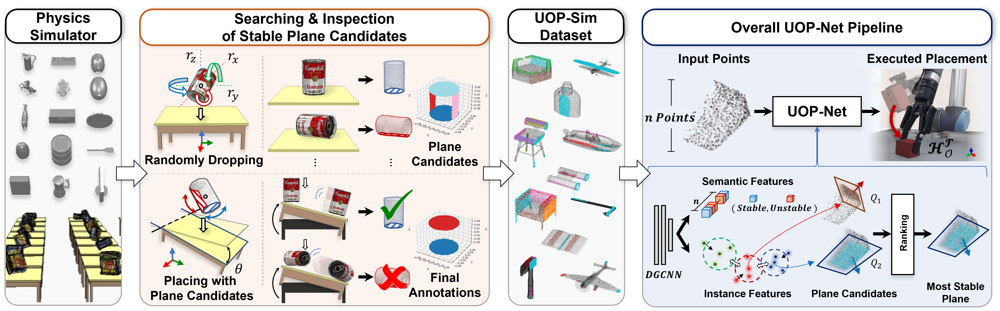

<!-- # UOP : Unseen Object Placement with Large Scale Simulation -->

<br>
<br>

<!-- TODO : add icons -->
<!-- add icons - projectpage / youtube / code / dataset link / AILAB hompage -->
<!-- TODO : add main concept image -->


<p align="center">
  <!--  -->
  <h1 align="center">
    <strong>UOP : Unseen Object Placement with Large Scale Simulation</strong>
  </h1>
</p>

<br>
<br>

<br>
<br>



This repository contains official implementation of following paper:

> **UOP-Net: Learning to Place Objects Stably using a Large-scale Simulation** <br>
> **Author:** *Anonymous* <br>
> **Abstract:** *Object placement is a fundamental task for robots, yet it remains challenging for partially observed objects. Existing methods for object placement have limitations, such as the requirement for a complete 3D model of the object or the inability to handle complex shapes and novel objects that restrict the applicability of robots in the real world. Herein, we focus on addressing the Unseen Object Placement(UOP) problem. We tackled the UOP problem using two methods: (1) UOP-Sim, a large-scale dataset to accommodate various shapes and novel objects, and (2) UOP-Net, a point cloud segmentation-based approach that directly detects the most stable plane from partial point clouds. Our UOP approach enables robots to place objects stably, even when the object's shape and properties are not fully known, thus providing a promising solution for object placement in various environments. We verify our approach through simulation and real-world robot experiments, demonstrating state-of-the-art performance for placing single-view and partial objects.* <br>
> [Click here for website and paper.](https://gistailab.github.io/uop/)

<br>
<br>

---

## 0. Environment Setting
<!-- checked -->
* Please follow instruction in ```setups``` [READMD_install.md](setups/README_install.md)

### ToDo

- [ ] UOP-Sim Evaluation Data Download link (with google drive)
- [ ] Release demo and test code
- [ ] Environment Setting ... update pkg requirements for training UOP-Net
- [ ] update Experiment Tables
- [ ] update Experiment Inferences
- [ ] update Experiment Demo


<br>
<br>

## Experiment Tables
- experiment table will be upload.

<br>
<br>

## Experiment Inferences
- experiment Inferences images will be upload.

<br>

### Partial View Generation
- experiment Inferences images will be upload.

<br>

<!-- Prototype Table #1 -->
<table>
  <thead>
    <tr>
      <th colspan="4"><b>Prototype Table #1</b></th>
    </tr>
  </thead>
  <tbody>
    <tr>
      <!-- 1 -->
      <td><b>Object</b></td>
      <td><b>Whole Points</b></td>
      <td><b>Stable Label</b></td>
      <td><b>Partial Points</b></td>
    </tr>
    <tr>
      <!-- 2 -->
      <td align="center" ></td>
      <th colspan="3" align="center"></th>
      <!-- <td></td>
      <td></td>
      <td></td> -->
    </tr>
    <tr>
      <!-- 3 -->
      <th colspan="4"><b>Inference Result</b></th>
    </tr>
    <tr>
      <!-- 4 -->
      <th colspan="4"></th>
    </tr>
  </tbody>
</table>

<br>

### Partial View Generation
- This is visualization of our partial points generation sequence(gif image).

<br>

| [**Object**](-) |
| :-:             |
|  |


<br>
<br>

## Experiment Demo
- experiment demo images will be upload.

<br>
<br>
<br>
<br>
<br>
<br>
<br>
<br>


---


## Citation

```
@article{noh2023learning,
  title={Learning to Place Unseen Objects Stably using a Large-scale Simulation},
  author={Noh, Sangjun and Kang, Raeyoung and Kim, Taewon and Back, Seunghyeok and Bak, Seongho and Lee, Kyoobin},
  journal={arXiv preprint arXiv:2303.08387},
  year={2023}
}
```

