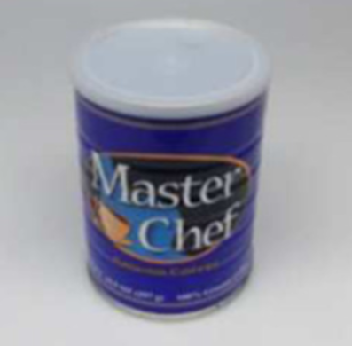

<!-- # UOP : Unseen Object Placement with Large Scale Simulation -->

<br>
<br>

<!-- TODO : add icons -->
<!-- add icons - projectpage / youtube / code / dataset link / AILAB hompage -->
<!-- TODO : add main concept image -->

<p align="center">
  
  <h1 align="center">
    <strong>Learning to Place Unseen Objects Stably using a Large-scale Simulation</strong>
  </h1>
</p>

<br>
<br>

This repository contains official implementation of following paper:

> **Learning to Place Objects Stably using a Large-scale Simulation** <br>
> 
> *We introduce the Unseen Object Placement (UOP) approach, combining UOP-Sim, a diverse dataset for various object shapes, with UOP-Net, a point cloud segmentation method for detecting stable planes from partial observation.* <br>
[Click here for website and paper.](https://gistailab.github.io/uop/)
<!-- This approach, validated through simulations and real-world tests, shows superior performance in placing objects with partial observation, enhancing the real-world robot applicability. -->
<!--  -->

<br>
<br>

---

## Environment Setting
* Please follow instruction in [setups/install.md](setups/install.md)

<br>

## Fast view our overall pipeline
* Please follow instruction in [setups/example.md](setups/example.md)
<p align="center">
  
</p>

<br>
<br>

## Download Data

#### Evaluation Data

- The *UOP-Sim* contains 63 YCB object datas for evaluation with 100 partial sampled points on each objects. these evaluation set was used for test and evaluate.
- You can inference and evaluate code after download this data
- *UOP-Sim* Evaluation data can be download this google drive [link](https://drive.google.com/file/d/19mmLYNT_2reMV7C7Z8pEWwgjBulVobCG/view?usp=drive_link) or run the [0.download_uop_sim_dataset.sh](./example/0.download_uop_sim_dataset.sh) command.
```shell
sh ./example/0.download_uop_sim_dataset.sh
# output : uop_data_for_evaluation.zip 
```

##### Evaluation Data File tree

```shell
└── uop_data
    └── ycb
        ├── 002_master_chef_can
        │   ├── inspected_zaxis.pkl   # uopsim label(axis of placement)
        │   ├── mesh_watertight.ply   # watertight mesh
        │   ├── model.ttm             # scene model to evaluate in simulation
        │   └── partial
        │       ├── 0.pkl             # partial sampled point cloud
        │       ├── 1.pkl
        │       ├── ...
        │       └── 99.pkl
        ├── 003_cracker_box
        ├── ...
        └── 077_rubiks_cube
127 directories, 6489 files, 171.1MB
```

#### Whole Data
You can download *UOP-Sim* dataset [here](https://drive.google.com/file/d/11yvzrLgIbv8e3Yy2gyCG0k2QMHepeGa0/view?usp=drive_link)

<br>
<br>

## Generate Data (optional)

If you want to generate *UOP-Sim* data yourself. Please follow the instruction in [setups/data_generation.md](./setups/data_generation.md)

<br>
<br>

## Inference and Evaluate

To place objects with placement modules; UOP(ours), RPF, CHSA, BBF

you should follow step by step instruction in [setups/uopnet.md](./setups/uopnet.md#inference)

or run the combined script below (you have to change path of uop data inside [partial_evaluate.sh](./partial_evaluate.sh))

```shell
sh ./partial_evaluate.sh
```

<br>
<br>

## Training (optional)

We propose pretrained model weight inside our repository.

If you want to training yourself please follow the instruction [here](./setups/uopnet.md#training)

<br>
<br>

## Inferences Result
- This is the UOP-Net and other methods Inferences images. Partial points are observed like follow [Partial View Generation](#partial-view-generation)

<!-- Prototype Table #1 -->
<p align="center">
  <table align="center">
    <thead>
      <tr>
        <th colspan="5"><b>Sample Inferences Result Visualization</b></th>
      </tr>
    </thead>
    <tbody>
      <tr>
        <!-- 1 -->
        <th colspan="2" align="center"><b>　Object　</b></th>
        <th colspan="1" align="center"><b>Whole Points</b></th>
        <th colspan="1" align="center"><b>Stable Label</b></th>
        <th colspan="1" align="center"><b>Partial Points</b></th>
      </tr>
      <tr>
        <!-- 2 -->
        <td colspan="2" align="center" ></td>
        <td colspan="3" align="center"></td>
        <!-- <td></td>
        <td></td>
        <td></td> -->
      </tr>
      <tr>
        <!-- 3 -->
        <th colspan="5"><b>Inference Result</b></th>
      </tr>
      <tr>
        <!-- 4 -->
        <td colspan="5">　　</td>
      </tr>
      <tr>
        <td colspan="1" align="center"><b>Partial Points</b></td>
        <td colspan="1" align="center"><b>　UOP-Net　</b></td>
        <td colspan="1" align="center"><b>RPF</b></td>
        <td colspan="1" align="center"><b>CHSA</b></td>
        <td colspan="1" align="center"><b>BBF</b></td>
      </tr>
    </tbody>
  </table>
</p>

<br>

### Partial View Generation
- This is visualization of our partial points generation sequence(gif image) and inference results at each partial points

<br>

<p align="center">
  <table>
    <thead>
      <tr>
        <th colspan="5"><b>Partial View Points & Inference Result</b></th>
      </tr>
    </thead>
    <tbody>
      <tr>
        <th colspan="5" align="center"></th>
      </tr>
      <tr>
        <th colspan="1" align="center"><b>Partial</b></th>
        <th colspan="1" align="center"><b>UOP-Net</b></th>
        <th colspan="1" align="center"><b>　RPF　</b></th>
        <th colspan="1" align="center"><b>　CHSA　</b></th>
        <th colspan="1" align="center"><b>　BBF　</b></th>
      </tr>
    </tbody>
  </table>
</p>

<br>
<br>


---


## Citation

```
@article{noh2023learning,
  title={Learning to Place Unseen Objects Stably using a Large-scale Simulation},
  author={Noh, Sangjun and Kang, Raeyoung and Kim, Taewon and Back, Seunghyeok and Bak, Seongho and Lee, Kyoobin},
  journal={arXiv preprint arXiv:2303.08387},
  year={2023}
}
```

## License

See [LICENSE](LICENSE)
