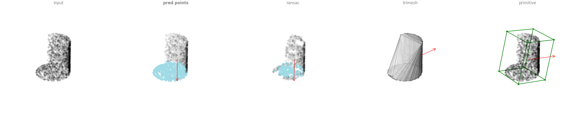

## Run Example codes

We provide Example script for whole pipeline of our project with YCB dataset.

### 1. Download YCB Dataset

Download YCB data with python script

- default is download "002_master_chef_can"

- if you want to download other specific object or all objects, then edit [download script #20~#25](../example/1.download_ycb_dataset.py)

  - other object: 002_master_chef_can, 003_cracker_box, 004_sugar_box ...

```shell
python example/1.download_ycb_dataset.py
```

### 2. Generate UOP-Sim Data

Generate UOP-Sim data for target object

For GUI control inside CoppeliaSim (put mouse button on )

- ```mouse left button down + move``` : translate view

- ```mouse wheel button down + move``` : rotate view
 
```shell
python example/2.data_generation.py --object 002_master_chef_can --visualize
```
- ```--object```: ycb object name

- ```--visualize```: if you want to visualize data generation process


#### The output saved like below 

```shell
example_results/
└── 002_master_chef_can                # name of ycb object
    ├── label.pkl                      # uopsim label(axis of placement)
    ├── mesh.ply                       # watertight mesh
    ├── model.ttm                      # scene model for coppeliasim
    ├── placement_axis.pkl             # axis of placement(before inspected)
    ├── stable_pose.pkl                # sampled stable pose from simulation
    ├── visualize_input_partial.html   # visualized partial points
    ├── visualize_label.html           # visualized points with label
    └── visualize_mesh.html            # visualized watertight mesh
```

#### Troubleshooting

For visualize data generation process you should follow instruction in environment setting(custom simulation parameter) [instruction](./install.md#troubleshooting)

### 3. Inference

Inference how to place the given YCB object with placement modules compared in our paper

- UOP: ours method

- RPF: ransac plane fitting

- CHSA: convex hull stability analysis from trimesh library

- BBF: primitive shape fitting


```shell
python example/3.inference.py --object 002_master_chef_can
```
- ```--object```: ycb object name

#### The output saved like below 

```shell
example_results/
└── 002_master_chef_can
    ├── result
    │   ├── BBF.png
    │   ├── BBF.pt
    │   ├── CHSA.png
    │   ├── CHSA.pt
    │   ├── RPF.png
    │   ├── RPF.pt
    │   ├── UOP.png
    │   ├── UOP.pt
    │   └── compare.png
    │    ...
    └── visualize_mesh.html
```

#### Module compare example (compare.png)




### 4.Test on Simulation

Test the inference result on simulation.

```shell
python example/4.test.py --object 002_master_chef_can --visualize
```
- ```--object``` : ycb object name 

- ```--visualize```: if you want to visualize 

#### The output should be as below

```shell
-----------------------------------------------------------------
Module           | UOP   | RPF   | CHSA  | BBF  
rotation(deg)    | 1.01  | 1.70  | 0.62  | 15.15
translation(cm)  | 0.27  | 0.41  | 0.14  | 3.31 
l2norm           | 1.01  | 1.70  | 0.62  | 15.15
Success(<10deg)  | True | True | True | False
-----------------------------------------------------------------
```
