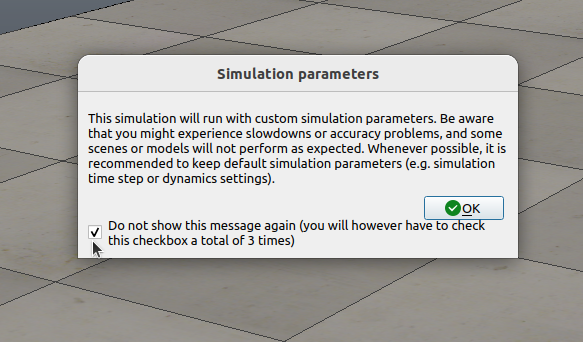

## Environment Setting
<!-- checked -->

Our code implemented on Ubuntu 20.04 and Conda virtual environment.

Please follow below instruction.

### Clone UOP-Net repository & thirdparty repository

```shell
git clone --recursive https://github.com/gist-ailab/uop-net.git
cd ./uop-net
```

### Create conda env & python requirements

<!-- checked -->
```shell
# create conda env
conda create -n uop_net python=3.8
conda activate uop_net

# install python requirements 
pip install --upgrade pip setuptools wheel
pip install trimesh plotly pyyaml open3d point_cloud_utils natsort tqdm scipy
```

```shell
# install pytorch with compatible CUDA version
conda install pytorch==1.12.1 torchvision==0.13.1 torchaudio==0.12.1 cudatoolkit=11.3 -c pytorch
```

### Simulation Setup 
<!-- checked -->

uop data generation code built in CoppeliaSim and PyRep. Please install CoppeliaSim and pyrep first [PyRep github](https://github.com/stepjam/PyRep)

```shell
# download coppelia sim(check ubuntu version)
wget https://www.coppeliarobotics.com/files/V4_1_0/CoppeliaSim_Edu_V4_1_0_Ubuntu20_04.tar.xz --no-check-certificate
tar -xvf CoppeliaSim_Edu_V4_1_0_Ubuntu20_04.tar.xz

# at first, you must run with GUI monitor setup
cd CoppeliaSim_Edu_V4_1_0_Ubuntu20_04/
./coppeliaSim.sh

# edit ~/.bashrc file
export COPPELIASIM_ROOT=EDIT/ME/PATH/TO/COPPELIASIM/INSTALL/DIR
export LD_LIBRARY_PATH=$LD_LIBRARY_PATH:$COPPELIASIM_ROOT
export QT_QPA_PLATFORM_PLUGIN_PATH=$COPPELIASIM_ROOT

# install pyrep
cd setups/thirdparty/PyRep
pip3 install -r requirements.txt
pip3 install .

cd ../../..
```

#### Troubleshooting

You shold follow below thing to run and visualize our simulation scenes

- video compressin library issue [CoppeliaSim issue](https://github.com/stepjam/PyRep/issues/142)
  - build vvcl and copy them to coppeliasim root
  
  ```shell
  # start from uop-net folder
  cd setups/thirdparty/videoRecorder/vvcl
  mkdir build
  cd build
  cmake ..
  make

  # apply to CoppeliaSim
  cp ./libvvcl.so $COPPELIASIM_ROOT
  ```

- custom simulation parameter warning(gui)
  - For visualize simulation (headless=False), you should check the below gui box **three times** for each environments (./uop_sim/coppeliasim/*.ttt)

  


### Build Manifold
<!-- checked -->

uop sim data use shapenet, 3dnet, ycb with watertight method [Manifold](https://github.com/hjwdzh/Manifold).

```shell
# start from uop-net folder
cd setups/thirdparty/Manifold
mkdir build
cd build
cmake .. -DCMAKE_BUILD_TYPE=Release
make
```
